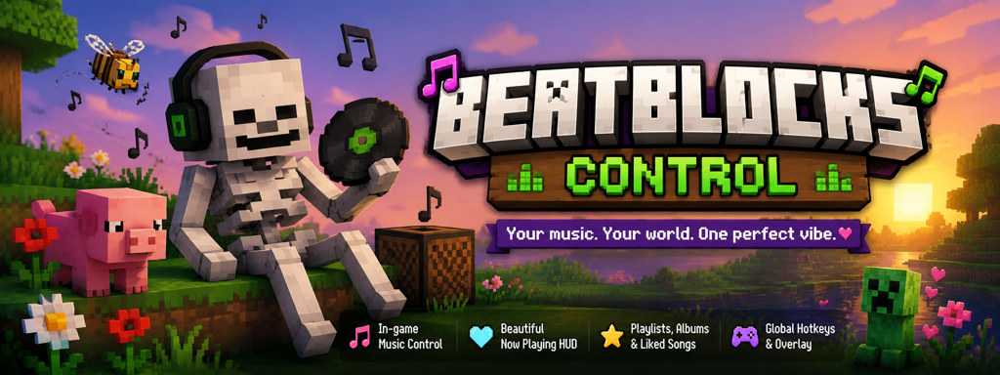
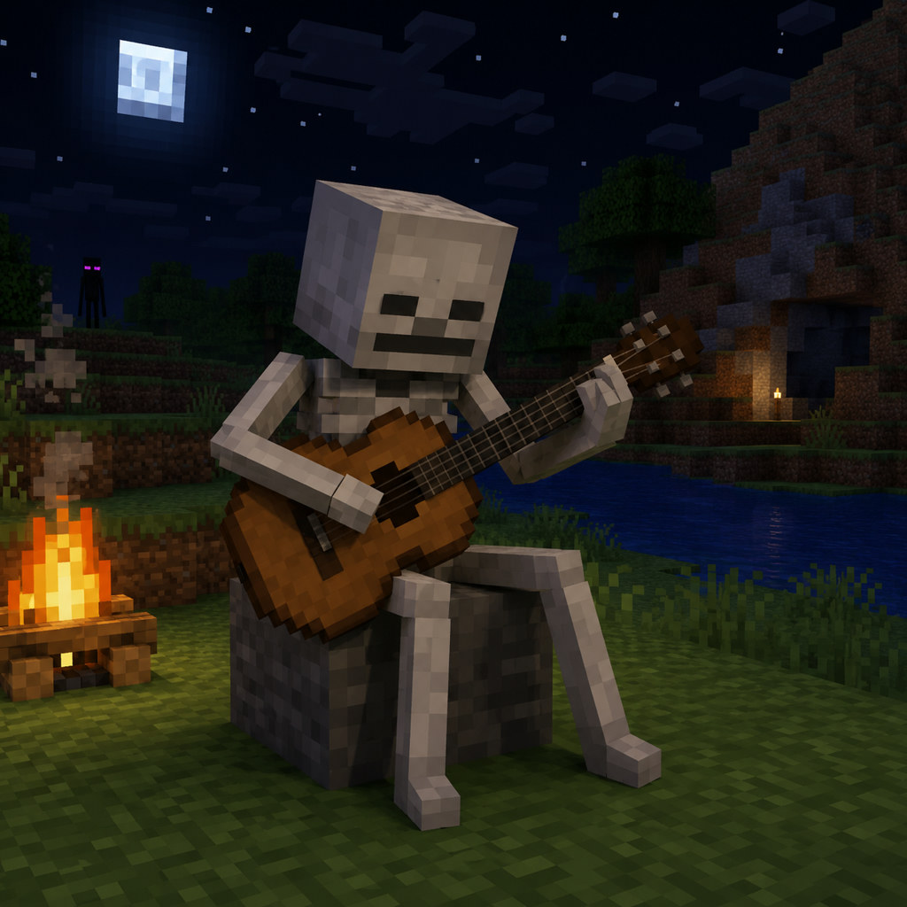
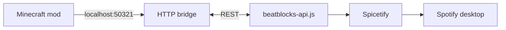

<p align="center">
  
</p>

<table align="center">
  <tr>
    <td align="center" width="180">
      
    </td>
    <td align="left" valign="middle">
      <h1 align="left">BeatBlocks Control</h1>
      <p align="left">
        <strong>Control Spotify from inside Minecraft</strong><br />
        Overlay · now-playing HUD · playlists · global hotkeys<br />
        <em>Local Spicetify bridge — no API keys in the mod</em>
      </p>
    </td>
  </tr>
</table>

<p align="center">
  <a href="https://github.com/vyas-devgna/beatblocks-control/releases/latest"></a>
  &nbsp;
  <a href="https://modrinth.com/project/beatblocks"></a>
  &nbsp;
  <a href="https://vyas-devgna.github.io/beatblocks-control/"></a>
</p>

<p align="center">
  
  
  
  
</p>

---

## What is BeatBlocks?

A **Fabric client mod** for Minecraft Java that controls your **Spotify desktop app** while you play:

| | |
|--|--|
| 🎵 | In-game **overlay** — playlists, albums, liked songs, queue |
| 💚 | **Now-playing HUD** with album art |
| 🎮 | **Hotkeys** — play/pause, next, previous (configurable) |
| 🔒 | **Private** — only talks to `127.0.0.1`; credentials stay in Spotify |

---

## Try it in 5 minutes

<details open>
<summary><strong>Requirements checklist</strong></summary>

| Need | Details |
|------|---------|
| Minecraft Java | **1.21 – 1.21.11** |
| Fabric | Loader ≥ 0.16.10 + **Fabric API** in `mods/` |
| Spotify desktop | Must stay open while playing |
| Spicetify | + `beatblocks-api.js` from this repo |

</details>

### 1 · Install Spicetify

```powershell
iwr -useb https://raw.githubusercontent.com/spicetify/cli/main/install.ps1 | iex
spicetify backup apply
```

### 2 · Add the bridge extension

Copy **`beatblocks-api.js`** → Spicetify Extensions:

| OS | Folder |
|----|--------|
| Windows | `%APPDATA%\spicetify\Extensions\` |
| Linux / macOS | `~/.config/spicetify/Extensions/` |

```powershell
.\scripts\setup-spicetify-bridge.ps1   # guided setup (Windows)
spicetify config extensions beatblocks-api.js
spicetify apply
```

Restart **Spotify** after apply.

### 3 · Install the mod

1. Download the JAR matching your **exact** MC version → [Releases](https://github.com/vyas-devgna/beatblocks-control/releases) or [Modrinth](https://modrinth.com/project/beatblocks)
2. Drop in `mods/` with **Fabric API**
3. Launch Minecraft

### 4 · Verify

1. Play a song in Spotify  
2. In-game: **Alt+I** (overlay) or `/sp`  
3. Optional: `.\scripts\test-spicetify-bridge.ps1`

**Stuck?** Spotify running? Spicetify applied? Correct JAR for your patch version?

---

## Controls

**Options → Controls → BeatBlocks**

| Action | Default |
|--------|---------|
| Open overlay | **Alt+I** |
| Play / pause | **K** |
| Next | **L** |
| Previous | **J** |

---

## Pick the right JAR

| Minecraft | Download |
|-----------|----------|
| 1.21.11 | `beatblocks-control-mc-1.21.11.jar` |
| 1.21.10 | `beatblocks-control-mc-1.21.10.jar` |
| 1.21.9 | `beatblocks-control-mc-1.21.9.jar` |
| 1.21.8 | `beatblocks-control-mc-1.21.8.jar` |
| 1.21.7 | `beatblocks-control-mc-1.21.7.jar` |
| 1.21.6 | `beatblocks-control-mc-1.21.6.jar` |
| 1.21.5 | `beatblocks-control-mc-1.21.5.jar` |
| 1.21.4 | `beatblocks-control-mc-1.21.4.jar` |
| 1.21.3 | `beatblocks-control-mc-1.21.3.jar` |
| 1.21.2 | `beatblocks-control-mc-1.21.2.jar` |
| 1.21.1 | `beatblocks-control-mc-1.21.1.jar` |
| 1.21 | `beatblocks-control-mc-1.21.jar` |

---

## How it works



---

## Roadmap

| | |
|--|--|
| **Now** | Spicetify bridge — Spotify + Spicetify + extension required |
| **Future** | Spotify Web API (simpler setup; needs API funding) |

---

## Support the project

BeatBlocks is built in spare time. **Sponsors and tips** help fund the Spotify API roadmap and ongoing updates.

<table align="center" cellpadding="16">
  <tr>
    <td align="center">
      <a href="https://github.com/sponsors/vyas-devgna" target="_blank" rel="noopener noreferrer" title="Sponsor vyasdevgna on GitHub" style="display:inline-flex;flex-direction:column;align-items:center;justify-content:center;background:#ffffff;padding:8px 32px;border-radius:16px;text-decoration:none;border:1px solid #e5e7eb;box-shadow:0 4px 6px -1px rgba(0,0,0,0.05), 0 2px 4px -2px rgba(0,0,0,0.05);transition:transform 0.2s;"><span style="color:#6b7280;font-family:sans-serif;font-size:14px;font-weight:600;">@vyas-devgna</span></a>
    </td>
    <td align="center">
      <a href="https://chai4.me/vyasdevgna" target="_blank" title="Support vyasdevgna on Chai4Me" style="display:inline-flex;flex-direction:column;align-items:center;justify-content:center;background:#ffffff;padding:8px 32px;border-radius:16px;text-decoration:none;border:1px solid #e5e7eb;box-shadow:0 4px 6px -1px rgba(0,0,0,0.05), 0 2px 4px -2px rgba(0,0,0,0.05);transition:transform 0.2s;"><span style="color:#6b7280;font-family:sans-serif;font-size:14px;font-weight:600;">@vyasdevgna</span></a>
    </td>
  </tr>
</table>

---

## Configuration

`.minecraft/config/beatblocks/beatblocks.json`

| Key | Default | Description |
|-----|---------|-------------|
| `bridgePort` | `50321` | Local HTTP port |
| `apiPollSeconds` | `4` | Poll interval |
| `hudScaleMultiplier` | `1.0` | HUD scale |
| `coverPixels` | `256` | Max cover size |
| `selectedMode` | `DEFAULT` | `DEFAULT` or `ENHANCED` |

---

## Building & contributing

```powershell
.\gradlew.bat clean build
.\scripts\build-minecraft-versions.ps1
.\gradlew.bat test
```

See [TESTING.md](TESTING.md) · [CONTRIBUTING.md](CONTRIBUTING.md) · [SECURITY.md](SECURITY.md)

---

## Links

| | |
|--|--|
| **Website** | https://vyas-devgna.github.io/beatblocks-control/ |
| **Releases** | https://github.com/vyas-devgna/beatblocks-control/releases |
| **Modrinth** | https://modrinth.com/project/beatblocks |
| **Issues** | https://github.com/vyas-devgna/beatblocks-control/issues |
| **Contributing** | [CONTRIBUTING.md](CONTRIBUTING.md) |

---

## License

MIT — see [LICENSE](LICENSE).