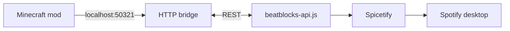

<p align="center">
  
</p>

<p align="center">
  
</p>

<h1 align="center">BeatBlocks Control</h1>

<p align="center">
  <strong>Control Spotify from inside Minecraft</strong> — overlay, now-playing HUD, playlists, and hotkeys.<br />
  Works through a <strong>local Spicetify bridge</strong>. No API keys or login inside the mod.
</p>

<p align="center">
  <a href="https://github.com/vyas-devgna/beatblocks-control/releases/latest"></a>
  <a href="https://modrinth.com/project/beatblocks"></a>
</p>

<p align="center">
  <a href="https://github.com/sponsors/vyas-devgna"></a>
  &nbsp;
  <a href="https://chai4.me/vyasdevgna" target="_blank" title="Support vyasdevgna on Chai4Me" style="display:inline-flex;flex-direction:column;align-items:center;justify-content:center;background:#ffffff;padding:8px 32px;border-radius:16px;text-decoration:none;border:1px solid #e5e7eb;box-shadow:0 4px 6px -1px rgba(0,0,0,0.05), 0 2px 4px -2px rgba(0,0,0,0.05);transition:transform 0.2s;"><span style="color:#6b7280;font-family:sans-serif;font-size:14px;font-weight:600;">@vyasdevgna</span></a>
</p>

<p align="center">
  
  
  
  
</p>

---

## What is this?

**BeatBlocks Control** is a client-side Fabric mod that lets you control the Spotify desktop app while you play Minecraft:

- Open an in-game **music overlay** (playlists, albums, liked songs, queue)
- See a **now-playing HUD** with album art
- Use **global hotkeys** for play/pause, next, and previous

The mod talks only to `127.0.0.1` on your PC. Spotify credentials never go into Minecraft.

---

## Try it in 5 minutes

### What you need

| Item | Notes |
|------|--------|
| **Minecraft Java** | 1.21 through 1.21.11 |
| **Fabric Loader** | ≥ 0.16.10 + **Fabric API** in `mods/` |
| **Spotify desktop** | Windows typical path; must stay open while playing |
| **Spicetify** | Customizes Spotify and runs our bridge extension |

### Step 1 — Install Spicetify

**Windows (PowerShell):**

```powershell
iwr -useb https://raw.githubusercontent.com/spicetify/cli/main/install.ps1 | iex
spicetify backup apply
```

### Step 2 — Add the bridge extension

Copy `beatblocks-api.js` from this repo into your Spicetify Extensions folder:

| OS | Path |
|----|------|
| Windows | `%APPDATA%\spicetify\Extensions\beatblocks-api.js` |
| Linux / macOS | `~/.config/spicetify/Extensions/beatblocks-api.js` |

Or run the guided script:

```powershell
.\scripts\setup-spicetify-bridge.ps1
```

Then enable it:

```powershell
spicetify config extensions beatblocks-api.js
spicetify apply
```

Restart **Spotify** after `spicetify apply`.

### Step 3 — Install the mod

1. Download the JAR that **exactly matches** your Minecraft version from **[Releases](https://github.com/vyas-devgna/beatblocks-control/releases)** or **[Modrinth](https://modrinth.com/project/beatblocks)**.
2. Put it in your instance `mods/` folder together with **Fabric API**.
3. Launch Minecraft.

### Step 4 — Check that it works

1. Open Spotify and start a song.
2. In Minecraft, press **Alt+I** (default) to open the overlay.
3. Optional: run `.\scripts\test-spicetify-bridge.ps1` to verify the local bridge.

**Not working?** Make sure Spotify is running, Spicetify applied successfully, and you picked the correct JAR for your Minecraft patch version.

---

## Controls (defaults)

Change these under **Options → Controls → BeatBlocks**.

| Action | Key |
|--------|-----|
| Open overlay | **Alt+I** |
| Play / pause | **K** |
| Next track | **L** |
| Previous track | **J** |

You can also use `/sp` in chat to open the overlay.

---

## Download the right JAR

Use **one JAR per Minecraft patch** — do not use a 1.21.5 JAR on 1.21.11.

| Minecraft | File name |
|-----------|-----------|
| 1.21.11 | `beatblocks-control-mc-1.21.11.jar` |
| 1.21.10 | `beatblocks-control-mc-1.21.10.jar` |
| 1.21.9 | `beatblocks-control-mc-1.21.9.jar` |
| 1.21.8 | `beatblocks-control-mc-1.21.8.jar` |
| 1.21.7 | `beatblocks-control-mc-1.21.7.jar` |
| 1.21.6 | `beatblocks-control-mc-1.21.6.jar` |
| 1.21.5 | `beatblocks-control-mc-1.21.5.jar` |
| 1.21.4 | `beatblocks-control-mc-1.21.4.jar` |
| 1.21.3 | `beatblocks-control-mc-1.21.3.jar` |
| 1.21.2 | `beatblocks-control-mc-1.21.2.jar` |
| 1.21.1 | `beatblocks-control-mc-1.21.1.jar` |
| 1.21 | `beatblocks-control-mc-1.21.jar` |

---

## Features

- **In-game music control** — play, pause, skip, browse library
- **Now-playing HUD** — track title, artist, album art (cached)
- **Playlists, albums & liked songs** — no in-overlay search (removed for stability)
- **Default & enhanced overlay** — pick your UI in settings
- **Diagnostics** — bridge / extension / heartbeat status in-game
- **Privacy** — localhost only; see [SECURITY.md](SECURITY.md)

---

## How it works (simple)



1. The mod starts a small server on `127.0.0.1:50321`.
2. The Spicetify extension sends playback updates and listens for commands.
3. Nothing leaves your computer except normal Spotify traffic.

---

## Roadmap

| Status | Plan |
|--------|------|
| **Now** | Spicetify bridge — Spotify must be open with Spicetify + `beatblocks-api.js` installed |
| **Future** | Native **Spotify Web API** support so setup may be simpler (still planning; API access has cost) |

I would like to add official Spotify API integration next. That needs developer API access and ongoing maintenance. Right now I am funding this in my spare time — **sponsorship helps a lot**:

- **[GitHub Sponsors](https://github.com/sponsors/vyas-devgna)** — recurring support
- **[Chai4Me](https://chai4.me/vyasdevgna)** — one-time tips (UPI / cards)

---

## Configuration

File: `.minecraft/config/beatblocks/beatblocks.json`

| Key | Default | Description |
|-----|---------|-------------|
| `bridgePort` | `50321` | Local HTTP port |
| `apiPollSeconds` | `4` | Playback poll interval |
| `hudScaleMultiplier` | `1.0` | HUD size |
| `coverPixels` | `256` | Max cover art size |
| `selectedMode` | `DEFAULT` | `DEFAULT` or `ENHANCED` |

---

## Building from source

Requires **Java 21**.

```powershell
.\gradlew.bat clean build
.\scripts\build-minecraft-versions.ps1   # all MC versions → releases/
.\gradlew.bat test
```

See [TESTING.md](TESTING.md) and [CONTRIBUTING.md](CONTRIBUTING.md).

---

## Links

| | |
|--|--|
| **Releases** | https://github.com/vyas-devgna/beatblocks-control/releases |
| **Modrinth** | https://modrinth.com/project/beatblocks |
| **Issues** | https://github.com/vyas-devgna/beatblocks-control/issues |
| **Contributing** | [CONTRIBUTING.md](CONTRIBUTING.md) |
| **Sponsor** | https://github.com/sponsors/vyas-devgna |
| **Tip jar** | https://chai4.me/vyasdevgna |

---

## License

MIT — see [LICENSE](LICENSE).