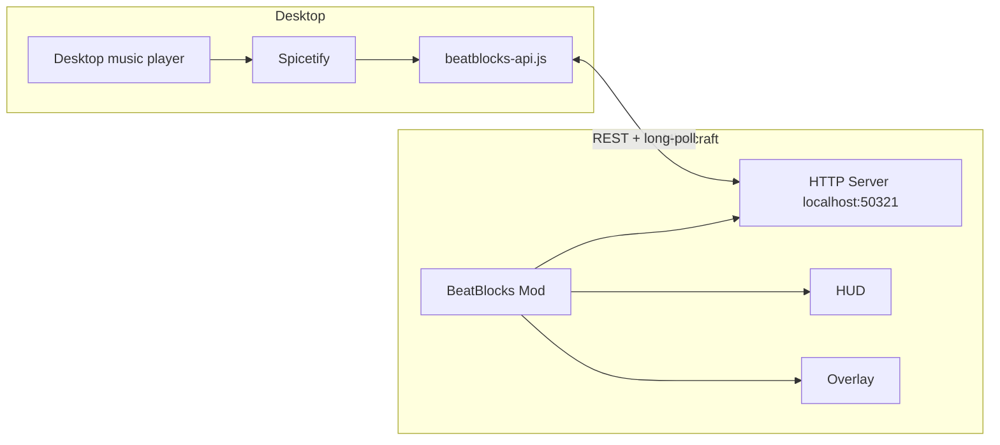

# BeatBlocks Control

[](https://minecraft.net)
[](https://fabricmc.net)
[](https://adoptium.net)
[](LICENSE)

Client-side **Fabric mod** for Minecraft Java that adds a BeatBlocks controller overlay, compact now-playing HUD, and global media hotkeys — powered by a **local Spicetify bridge**. No OAuth, no API credentials, no developer dashboard.

> **Zero login in the mod.** BeatBlocks controls your already-running desktop music player through a Spicetify extension. Credentials stay in the desktop app; the mod only talks to `localhost`.

## Features

| Feature | Description |
|---------|-------------|
| **Local bridge** | Controls playback via Spicetify — no mod-side login |
| **Diagnostics** | Live bridge / extension / heartbeat status |
| **Enhanced overlay** | Playlists, liked songs, albums, queue, now playing |
| **Default overlay** | Settings, HUD scale, mode selection, transport |
| **Compact HUD** | Resizable now-playing widget with transport buttons |
| **Cover art** | Sharp cached album art (configurable resolution) |
| **Hotkeys** | Play/pause, next, previous (configurable) |

Search was removed from the overlay and bridge — library browsing uses playlists, albums, and liked songs only.

## Supported Minecraft versions

Pre-built JARs are published per version (see [Releases](https://github.com/devgnav/beatblocks-control/releases)):

| Minecraft | Release asset |
|-----------|---------------|
| 1.21.5 | `beatblocks-control-mc-1.21.5.jar` |
| 1.21.4 | `beatblocks-control-mc-1.21.4.jar` |
| 1.21.3 | `beatblocks-control-mc-1.21.3.jar` |
| 1.21.2 | `beatblocks-control-mc-1.21.2.jar` |
| 1.21.1 | `beatblocks-control-mc-1.21.1.jar` |
| 1.21 | `beatblocks-control-mc-1.21.jar` |

Newer Minecraft releases need a **new tested build** — do not assume a 1.21.5 JAR works on 1.22+.

## How it works



The mod starts an HTTP server on `127.0.0.1:50321`. The Spicetify extension:

1. Pushes playback state to `POST /state`
2. Long-polls `GET /commands` for play/pause/next/library requests
3. Posts results to `POST /response`

## Setup guide

### Prerequisites

- Minecraft Java **1.21 – 1.21.5** with **Fabric Loader** ≥ 0.16.10 and **Fabric API**
- Desktop music player with **Spicetify** (Windows: typical install uses `Spotify.exe`)
- **Java 21+** for building; the game runtime can use the launcher’s bundled Java

### 1. Install Spicetify

```powershell
iwr -useb https://raw.githubusercontent.com/spicetify/cli/main/install.ps1 | iex
spicetify backup apply
```

### 2. Deploy the bridge extension

Copy `beatblocks-api.js` from this repo to:

- **Windows:** `%APPDATA%\spicetify\Extensions\beatblocks-api.js`
- **Linux/macOS:** `~/.config/spicetify/Extensions/beatblocks-api.js`

Or run the guided script:

```powershell
.\scripts\setup-spicetify-bridge.ps1
```

Register and apply:

```powershell
spicetify config extensions beatblocks-api.js
spicetify apply
```

### 3. Install the mod

1. Download the JAR for your Minecraft version from [Releases](https://github.com/devgnav/beatblocks-control/releases)
2. Place it in your instance `mods/` folder with **Fabric API**
3. Launch Minecraft

### 4. Verify

```powershell
.\scripts\test-spicetify-bridge.ps1
```

In-game: open the desktop player, start playback, press **Alt+I**, check bridge status in the overlay.

## Controls

Configurable under **Options → Controls → BeatBlocks**.

| Action | Default | Notes |
|--------|---------|-------|
| Open overlay | Alt+I | Default or Enhanced UI |
| Play / pause | K | Global when not typing |
| Next track | L | |
| Previous track | J | |

## Configuration

File: `.minecraft/config/beatblocks/beatblocks.json`

| Key | Default | Description |
|-----|---------|-------------|
| `bridgePort` | `50321` | Local HTTP port (must match extension) |
| `apiPollSeconds` | `4` | Playback poll interval |
| `hudScaleMultiplier` | `1.0` | HUD size (0.35–3.0 in overlay) |
| `coverPixels` | `256` | Max cover art dimension |
| `selectedMode` | `DEFAULT` | `DEFAULT` or `ENHANCED` |

## Building from source

Requires **Java 21** (`JAVA_HOME` or Prism Launcher runtime).

```powershell
# Single version (default 1.21.5 from gradle.properties)
.\gradlew.bat clean build

# All supported versions
.\scripts\build-minecraft-versions.ps1
```

Output: `releases/beatblocks-control-mc-<version>.jar` (not committed — upload to GitHub Releases).

Tests:

```powershell
.\gradlew.bat test
```

See [TESTING.md](TESTING.md) for QA checklists.

## Project structure

```
beatblocks-control/
├── beatblocks-api.js          # Spicetify bridge extension
├── src/main/java/com/devgnav/beatblocks/
│   ├── BeatBlocksClient.java
│   ├── BeatBlocksServices.java
│   ├── config/BeatBlocksConfig.java
│   ├── spotify/BeatBlocksApiClient.java   # Bridge server + API
│   ├── ui/                                # HUD + overlays
│   └── mode/ModeManager.java
├── scripts/
│   ├── setup-spicetify-bridge.ps1
│   ├── test-spicetify-bridge.ps1
│   └── build-minecraft-versions.ps1
└── TESTING.md
```

## Privacy

See [SECURITY.md](SECURITY.md). Summary: localhost-only bridge, no telemetry, no mod-side credentials.

## License

MIT — see [LICENSE](LICENSE).